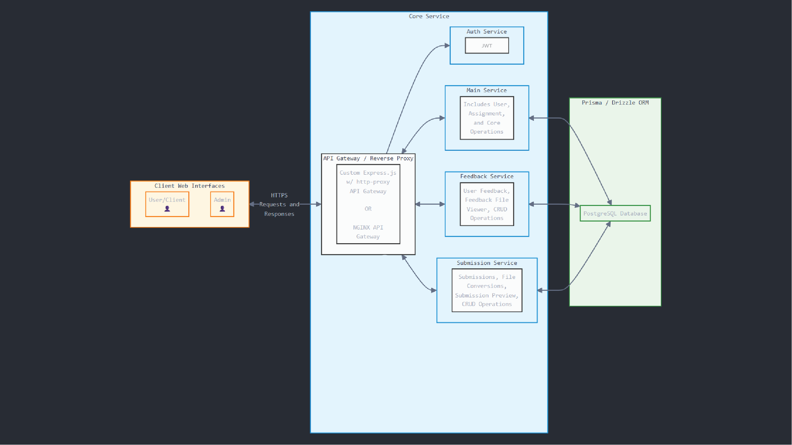
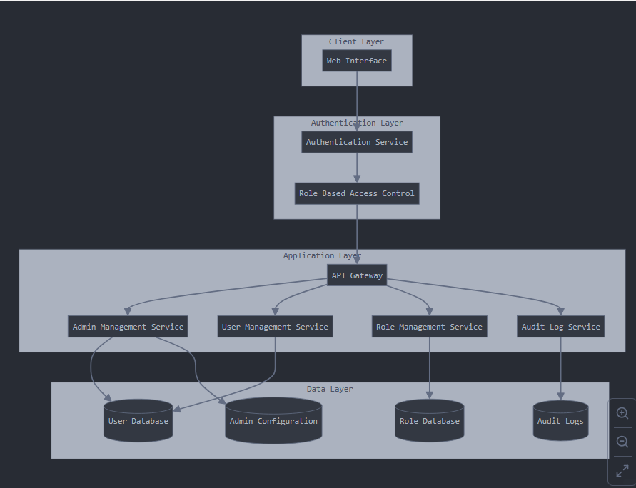
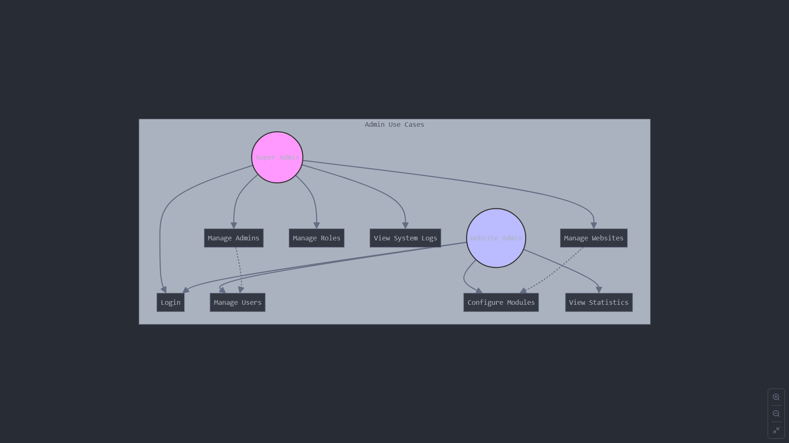
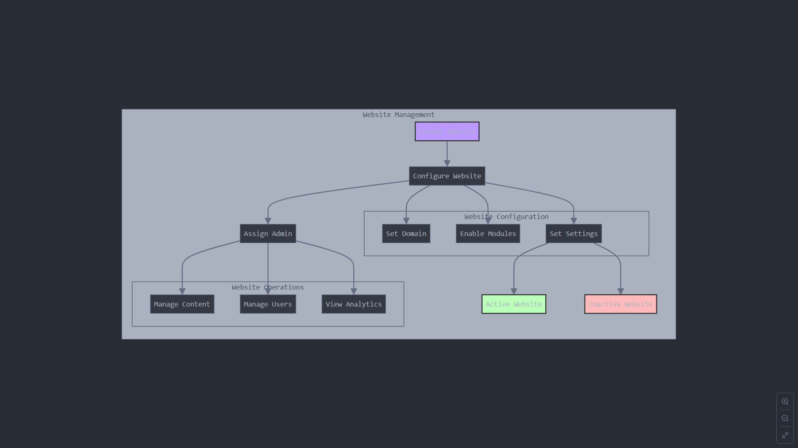
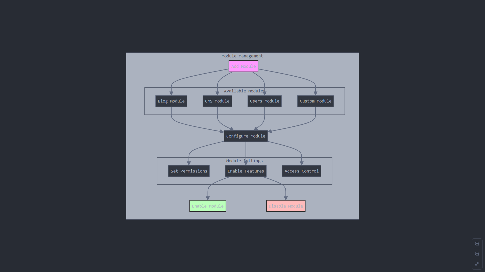
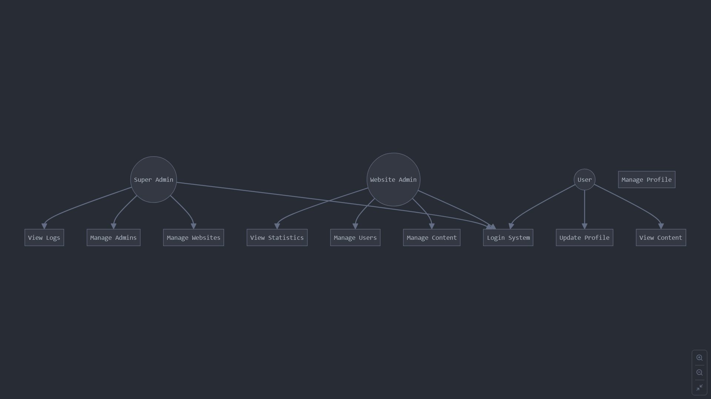
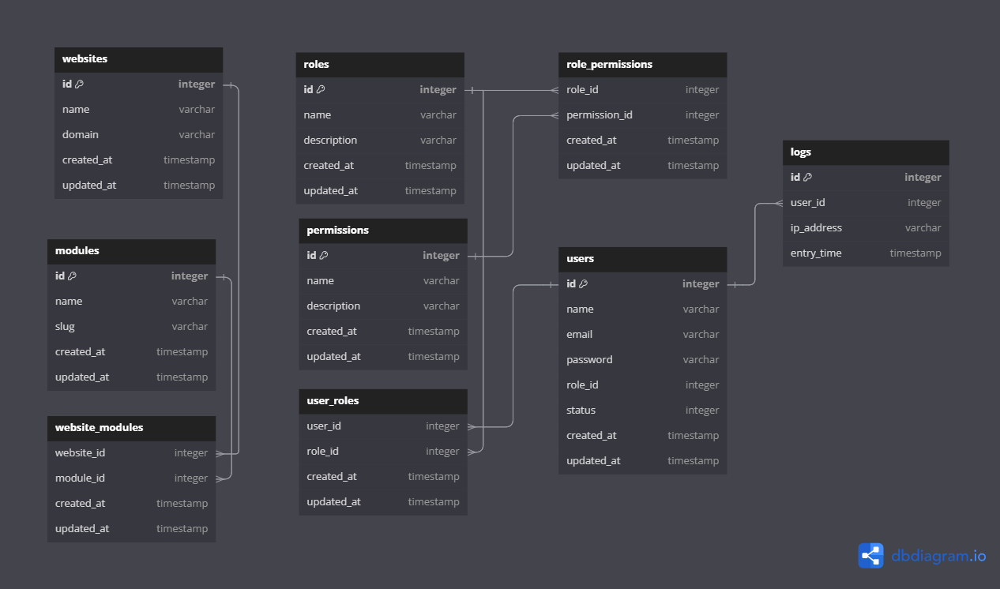
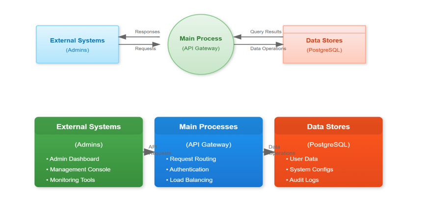

# System Design Template

## Introduction
The Global Admin Panel is designed to serve as a centralized control system for managing multiple websites and their associated configurations. Its primary purpose is to provide administrators with the tools needed to efficiently oversee and maintain various websites, modules, and user roles from a single interface. This system is particularly useful for organizations or platforms that operate multiple websites, ensuring consistency, scalability, and ease of management.

### Core Functionality:

1. **Managing Multiple Websites**:
   - The global admin panel allows administrators to create, update, and delete websites.
   - Each website can have its own unique domain, configuration settings, and assigned modules.
   - Administrators can monitor the status of all websites (e.g., active, inactive) and manage their lifecycle.
     
2. **Centralized Control System**:
   - A single dashboard provides a unified view of all websites and their associated data.
   - Administrators can manage users, roles, permissions, and modules across multiple websites.
   - Centralized logging and activity monitoring ensure transparency and accountability.
     
3. **Website Configuration Management**:
   - Administrators can configure settings for each website, such as domain names, themes, and custom features.
   - Configuration changes can be applied globally or on a per-website basis, depending on the administrator's requirements.
   - Version control for configurations ensures that changes can be rolled back if necessary.
     
4. **Module System Implementation**:
   - The global admin panel supports a modular architecture, allowing administrators to assign specific functionalities (modules) to each website.
   - Modules can include features like blogs, contact forms, slider, or custom integrations.
   - Administrators can enable, disable, or configure modules for individual websites, ensuring flexibility and customization.

## System Architecture Design
Architecture Pattern Chosen **: Hybrid Configuration System**.

1. **Justification for pattern choice**:
    - The global admin panel requires centralized management of multiple websites, but each website may have unique configurations. A hybrid approach allows for both global oversight and website-specific        customizations.
    - Performance Optimization. Reduces latency and improves response times for end-users.
    - By separating global configurations from website-specific ones, the system can isolate issues and ensure that failures in one part of the system do not cascade to others.
  
2. **Performance Optimization**:
   - Load only the necessary modules and configurations for each website, reducing memory usage and improving startup times.
   - Serve static assets (e.g., images, CSS, JavaScript) via a CDN to reduce server load and improve page load times.
   - Cache API responses for frequently accessed data (e.g., user roles, permissions).
     
3. **Resource Management Strategy**:
   - Use connection pooling to manage database connections efficiently.
   - Regularly monitor and optimize queries to prevent performance degradation.
   - Regularly back up configurations and database data to prevent data loss.

### Architecture Diagrams
- System Architecture Design
  
  

- Core system components
  
  

## Use Case Models

| Use Case ID | Use Case Name | Actor(s) |
|-------------|---------------|----------|
| UC-01       | Manage Websites              | Admin/Website Manager     |
| UC-02       | Configure Website Settings   | Admin/Website Manager     |
| UC-03       | Assign Modules to Websites   | Admin/Website Manager     |
| UC-04       | Manage Users                 | Admin                     |
| UC-05       | Manage Roles and Permissions | Admin                     |
| UC-06       | View Activity Logs           | Admin                     |

[For each use case, document:]

**UC-01: Manage Websites**

| ID:             | UC-01                            |
|-----------------|-------------------------------|
| Name:           | Manage Websites              |
| Actor(s):       | Admin/Website Manager                    |
| Flow of Events: |                               |
|                 | 1. Admin logs into the global admin panel. |
|                 | 2. Admin navigates to the "Websites" section. |
|                 | 3. Admin creates a new website by entering details (name, domain, etc.). |
|                 | 4. Admin updates or deletes an existing website as needed. |
|                 | 5. System saves changes and updates the website list. |
| Pre-Conditions: |                               |
|                 | 1. Admin must be authenticated and authorized to manage websites. |
|                 | 2. Database connection must be active. |
| Post-Conditions:|                               |
|                 | 1. The website is successfully created, updated, or deleted in the system. |
|                 | 2. Changes are reflected in the global admin panel. |
| Description:    | This use case allows administrators to create, update, and delete websites from the global admin panel. It ensures centralized control over all websites managed by the system. |

**UC-02: Configure Website Settings**

| ID:             | UC-02                            |
|-----------------|----------------------------------|
| Name:           | Configure Website Settings              |
| Actor(s):       | Admin/Website Manager                   |
| Flow of Events: |                                         |
|                 | 1. Admin selects a specific website from the list.|
|                 | 2. Admin navigates to the "Settings" tab for the selected website. |
|                 | 3. Admin modifies configuration settings (e.g., theme, domain, custom features). |
|                 | 4. Admin saves the changes. |
|                 | 5. System applies the updated settings to the website. |
| Pre-Conditions: |                               |
|                 | 1. Admin must be authenticated and authorized to manage websites. |
|                 | 2. The website must already exist in the system. |
| Post-Conditions:|                               |
|                 | 1. The website's configuration is updated in the database. |
|                 | 2. Changes are reflected on the live website. |
| Description:    | This use case enables administrators to customize the settings of individual websites, ensuring flexibility and personalization. |

**UC-03: Assign Modules to Websites**

| ID:             | UC-03                          |
|-----------------|--------------------------------|
| Name:           | Assign Modules to Websites     |
| Actor(s):       | Admin/Website Manager          |
| Flow of Events: |                                |
|                 | 1. Admin selects a specific website from the list.|
|                 | 2. Admin navigates to the "Modules" section for the selected website. |
|                 | 3. Admin enables or disables modules (e.g., blog, contact form) for the website. |
|                 | 4. Admin saves the changes. |
|                 | 5. System updates the website's module configuration. |
| Pre-Conditions: |                               |
|                 | 1. Admin must have access to the selected website. |
|                 | 2. The website must already exist in the system. |
| Post-Conditions:|                               |
|                 | 1. The website's module configuration is updated in the database. |
|                 | 2. Enabled modules are reflected on the live website. |
| Description:    | This use case allows administrators to assign and configure modules for individual websites, enabling tailored functionality. |

**UC-04: Manage Users**

| ID:             | UC-04                          |
|-----------------|--------------------------------|
| Name:           | Manage Users                   |
| Actor(s):       | Admin                          |
| Flow of Events: |                                |
|                 | 1. Admin navigates to the "Users" section in the global admin panel.|
|                 | 2. Admin creates a new user by entering details (name, email, role, etc.). |
|                 | 3. Admin updates or deletes an existing user as needed. |
|                 | 4. System saves changes and updates the user list. |
| Pre-Conditions: |                               |
|                 | 1. Admin must be authenticated and authorized to manage users. |
|                 | 2. Database connection must be active. |
| Post-Conditions:|                               |
|                 | 1. The user is successfully created, updated, or deleted in the system. |
|                 | 2. Changes are reflected in the global admin panel. |
| Description:    | This use case allows administrators to manage user accounts, ensuring proper access control across the system. |

## Use Case Diagram
- Admin interactions
  
  
- Website management flows
  
  
- Module system interactions
  
  
  -  Use case diagram 

  

## Database Design

## Data Flow Diagrams

### Level 0 DFD
The Level 0 DFD represents our Multi-Admin Panel Management System, showcasing the interaction between three primary user types and the central system. At its core, we have Super Admins who possess the highest level of access, managing multiple websites, controlling system-wide settings, and overseeing user roles and permissions.

### Level 1 DFD
[Detail:
- Website management flows
- Configuration management
- Module system processes
- Security processes]

## User Interface Design

[For each major interface:
- Purpose
- Key components
- Navigation
- Interaction patterns]

### Core Interfaces:
1. Dashboard
2. Website Management
3. Module Configuration
4. System Monitoring
5. User Management

## Technical Specifications

**@** **Frontend implementation**: 
1. **Framework**: React.js + Next.js for server-side rendering.
2. **State Management**: Redux for global state, React Context for local state.
3. **UI Components**:
      - Material-UI for core components
      - Custom styled-components for specific needs
      - Responsive design using Tailwind CSS
   
 **@** **Backend services**: 
1. **Framework**: Node.js with Express.js.
2. **Features:**:
      - RESTful API design
      - Request validation using express-validator
      - Error handling middleware
          
**@** **Database Structure**: 
**Database**: PostgreSQL

**@** **Security Implementation**: 
1. **Authentication:**:
      - JWT-based authentication
      - Password hashing using bcrypt
2. **Authentication:**:
      - Role-based access control (RBAC)
      - Permission-based actions
      - API endpoint protection
        
**@** **Performance Requirements**: 
1. **Optimization:**:
      - Code splitting
      - Lazy loading of components
      - Image optimization
      - Minification of assets
      - Database query optimization